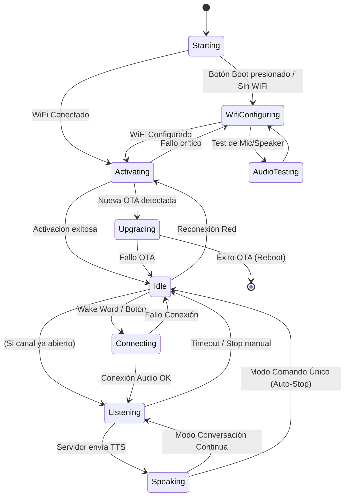

# Máquina de Estados Finitos (MEF) del Sistema Xiaozhi

Este documento describe el funcionamiento de la máquina de estados que gobierna el comportamiento del firmware, las transiciones permitidas y los efectos colaterales en el hardware (Audio, Pantalla, WiFi).

## Diagrama de Estados

## Descripción de Estados

| Estado | Descripción | Comportamiento de Audio | Pantalla (Kotty) |
| :--- | :--- | :--- | :--- |
| **Unknown** | Estado inicial indefinido. | Inactivo | Negro / Logo |
| **Starting** | Inicializando drivers y periféricos. | Inactivo | Logo |
| **WifiConfiguring** | Punto de acceso (AP) activo para configurar credenciales. | WW: Off, VAD: Off | Icono: Gear (Amarillo) |
| **Activating** | Conectando a servidor, verificando versión, descargando assets. | WW: Off, VAD: Off | Icono: Gear (Amarillo) |
| **Idle** (Standby) | Esperando comando. Estado de bajo consumo. | **WW: ON**, VAD: Off | Icono: Clock (Azul) |
| **Connecting** | Estableciendo canal de audio (WebSocket/UDP) tras despertar. | WW: Off, VAD: Off | Icono: Gear (Amarillo) |
| **Listening** | Escuchando al usuario y enviando audio al servidor. | WW: Off, **VAD: ON** | Icono: Mic (Rojo) |
| **Speaking** | Reproduciendo respuesta del asistente (TTS). | WW: Off*, VAD: Off | Icono: Volume (Verde) |
| **Upgrading** | Actualizando firmware (OTA). | Inactivo | Texto: Progreso |
| **FatalError** | Error irrecuperable. | Inactivo | Icono: Exclamación |

*\*Nota: En hardware con cancelación de eco (AEC) por hardware (DSP dedicado), el Wake Word podría estar activo durante Speaking (Barge-in).*

## Lógica de Transiciones Críticas

### 1. Despertar (Wake Up)
*   **Origen:** `Idle`
*   **Disparador:** Detección de Wake Word (local) o Pulsación Botón (Boot).
*   **Acción:**
    1.  `AudioService` empaqueta los datos del Wake Word.
    2.  Si el canal de audio está cerrado -> Transición a `Connecting`.
    3.  Si el canal ya está abierto -> Transición directa a `Listening`.

### 2. Inicio de Escucha (Start Listening)
*   **Origen:** `Connecting` (éxito) o `Speaking` (continuo).
*   **Estado:** `Listening`
*   **Efectos:**
    *   **Audio:** Se habilita el procesamiento de voz (VAD + Encoder Opus). Se deshabilita Wake Word.
    *   **Red:** Se envía paquete `start_listening` al servidor.
    *   **UI:** Icono Micrófono Rojo.

### 3. Respuesta del Asistente (Speaking)
*   **Origen:** `Listening`
*   **Disparador:** Recepción de evento JSON `tts` con estado `start` desde el servidor.
*   **Estado:** `Speaking`
*   **Efectos:**
    *   **Audio:** Se deshabilita el procesamiento de voz (micrófono "muteado" lógicamente para evitar eco, a menos que haya AEC hardware). Se decodifica y reproduce audio Opus recibido.
    *   **UI:** Icono Altavoz Verde.

### 4. Fin de Interacción (Back to Idle)
*   **Origen:** `Speaking`
*   **Disparador:** Recepción de evento JSON `tts` con estado `stop`.
*   **Condición:** Si el modo de escucha es `kListeningModeAutoStop` (comando único).
*   **Estado:** `Idle`
*   **Efectos:**
    *   **Audio:** Se detiene reproducción. Se limpia cola de decodificación. **Se debe reactivar Wake Word.**
    *   **UI:** Icono Reloj Azul.
    *   **Riesgo:** Aquí es donde ocurren los fallos "sordos" si el Wake Word no se reinicia correctamente.

## Puntos de Conflicto Detectados (Erráticos)

1.  **Reactivación de Wake Word:** Al volver a `Idle`, el sistema llama a `EnableVoiceProcessing(false)` y luego `EnableWakeWordDetection(true)`. En chips con poca RAM (C3), si la liberación de recursos del procesador de voz es lenta, la inicialización del Wake Word puede fallar silenciosamente o quedar en un estado inconsistente.
2.  **Sample Rate:** El Wake Word requiere 16kHz. Si el codec estaba en otro rate, el resampler entra en juego. Cambios dinámicos de frecuencia pueden desestabilizar el flujo. (Corregido a 16kHz fijo).
3.  **Gestión de colas:** Si quedan buffers "basura" en las colas de audio al cambiar de estado, el detector de Wake Word puede recibir ruido inicial y bloquearse o dispararse falsamente.

## Referencia de Código

*   **Gestor de Estados:** `main/device_state_machine.cc`
*   **Manejador de Eventos:** `Application::HandleStateChangedEvent` en `main/application.cc`
*   **Servicio de Audio:** `main/audio/audio_service.cc`
